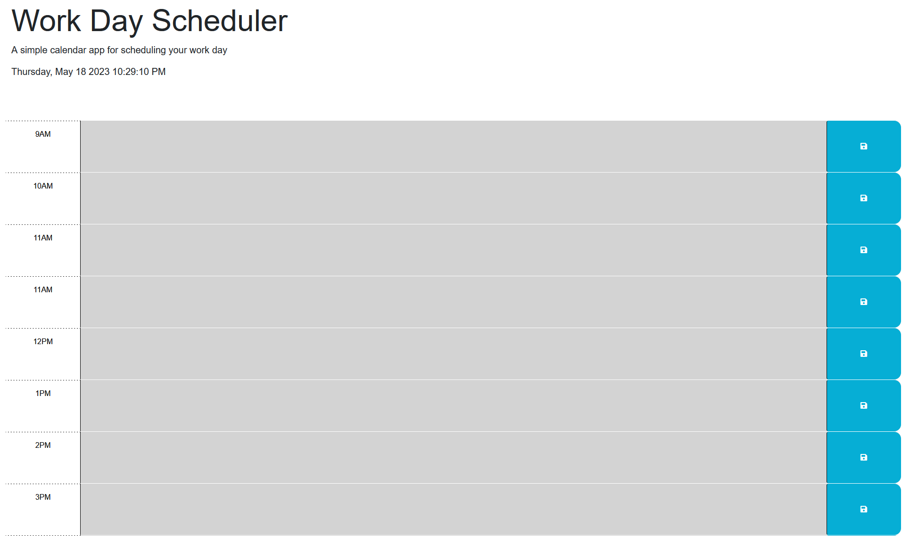

# Work Day Scheduler

Deployed Application: https://jeffrpar.github.io/work-day-scheduler/

## Description

I was challenged with writing the JavaScript for a custom scheduling web app so a user can manage their time. The main function of this page will allow the user to enter custom text into each day's time blocks, and save it so they won't lose it upon refreshing, closing, or going off-site. This is accomplished by storing that custom text into local storage when the user clicks the save button for each time block they want to customize, and updating the element with that saved info upon page load.

## License

Please refer to the license in the repository.